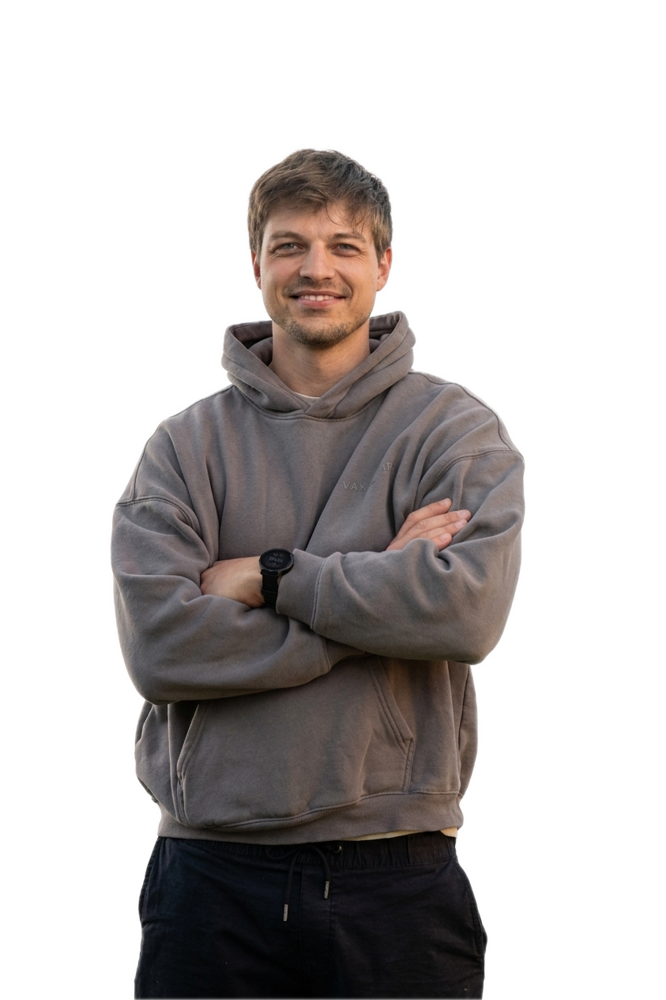

# Yannic Jundt | Frontend Developer Portfolio

This is my personal developer portfolio, built to present who I am, what I am currently learning, and the projects I have worked on so far.

I am a frontend developer from Germany with a strong interest in clean interfaces, structured code, and practical problem solving. My current focus is frontend development with HTML, CSS, JavaScript and modern web workflows, while continuously growing towards fullstack development and the technologies that will shape future web applications.

## Live Portfolio

Visit the portfolio here: [yannicjundt.de](https://yannicjundt.de)

## Tech Stack

The portfolio itself is built with:

  
  
  

- HTML
- CSS
- JavaScript
- PHPMailer for the contact form

## Features

- Responsive portfolio website
- Horizontal section-based navigation
- Smooth scrolling between sections
- Project showcase with live/demo and GitHub link areas
- Skills overview with custom icons
- Contact form connected through a PHP mail setup
- Legal notice page

## Projects

### Join

A task manager inspired by the Kanban system. The project focuses on organizing tasks, working with drag and drop interactions, and building a structured application experience.

Technologies used: Angular, TypeScript, HTML, CSS, Firebase

### Fallen Angeles

A jump-and-run game based on an object-oriented JavaScript structure. The project helped me practice game logic, class-based code organization, animation, and browser-based interaction.

Technologies used: JavaScript, HTML, CSS

### DA Bubble

A collaboration and messaging app concept focused on team communication, real-time interaction, and a structured user interface for productive workflows.

Technologies used: JavaScript, HTML, CSS

### Ongoing Work

My portfolio also includes an area for ongoing projects, because I want the website to reflect my current learning path and not only finished work. I am especially interested in improving my understanding of fullstack development, backend workflows, APIs, databases, and scalable application structure.

## Repository

GitHub repository: [TheYan3/Portfolio](https://github.com/TheYan3/Portfolio)

## Contact

- Email: [3.j.yannic@gmail.com](mailto:3.j.yannic@gmail.com)
- GitHub: [github.com/TheYan3](https://github.com/TheYan3)
- LinkedIn: [LinkedIn profile placeholder](https://linkedin.com)

